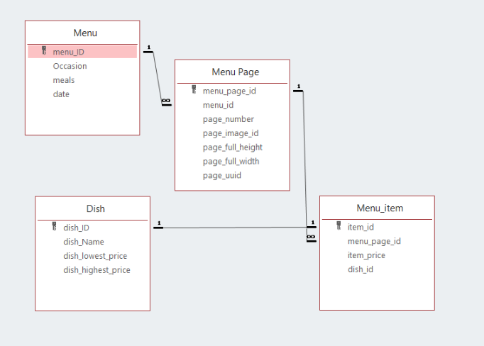

# Data_Cleaning_Project

## Description
Dataset: New York Public Library Menu  
url: http://menus.nypl.org/ 

## Create Relational Database with SQL
Relational Database Design 
  
 - Menu has one to many relationship with menu page table through foreign key menu_id since each menu may have more than one pages. menu_id is a primary key in the menu table and a foreign key in the men page table.  
 - Menu page table has one to many relationship with menu item table through menu_page_id since each page may have more than one items. - menu_page_id is a primary key in the menu page table and a foreign key in the menu item table.  
 - Menu item has one to one relationship with dish table through item_id since each item has to associate with exactly one dish on the menu page. Each dish can’t exist more than one time in the menu. Dish_id is a primary key in the dish table and a foreign key in the menu item table. 

## Profiling The Database
- Entity Integrity Constraint 
  The entity integrity constraints states that primary key value can’t be null. This is because they primary key value is used to identify   individual rows in relation and dif the primary key has a null value, we can’t identify those rows. We look at each primary keys in four   tables to check if null value exists. In the Menu table, there are 228 rows.  
  
- Key Integrity Constraint 
  Keys are the entity set that is used to identify an entity within its entity set uniquely. An entity set can have multiple keys, but out   of which one key will be the primary key. Primary key is designed to uniquely identify all table records. We are looking for the records   have different primary keys with same information in four tables. 

- Referential  Integrity Constraints 
  A referential integrity constraint is specified between two tables with relationship. If a foreign key in Table 1 refers to the primary     key of table 2, then every value of the foreign key in table 1 must be available in table. We look at every two tables that are related     with each other to check their referential integrity constraints.  
  
## Result 
- Displaying all meals for a given dish. We will use celery as an example 
 

- Displaying all occasions with a given dish. We use celery as an example.  
 

- Displaying the price changes of a given dish over time. 
 

# Workflow

